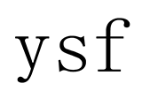
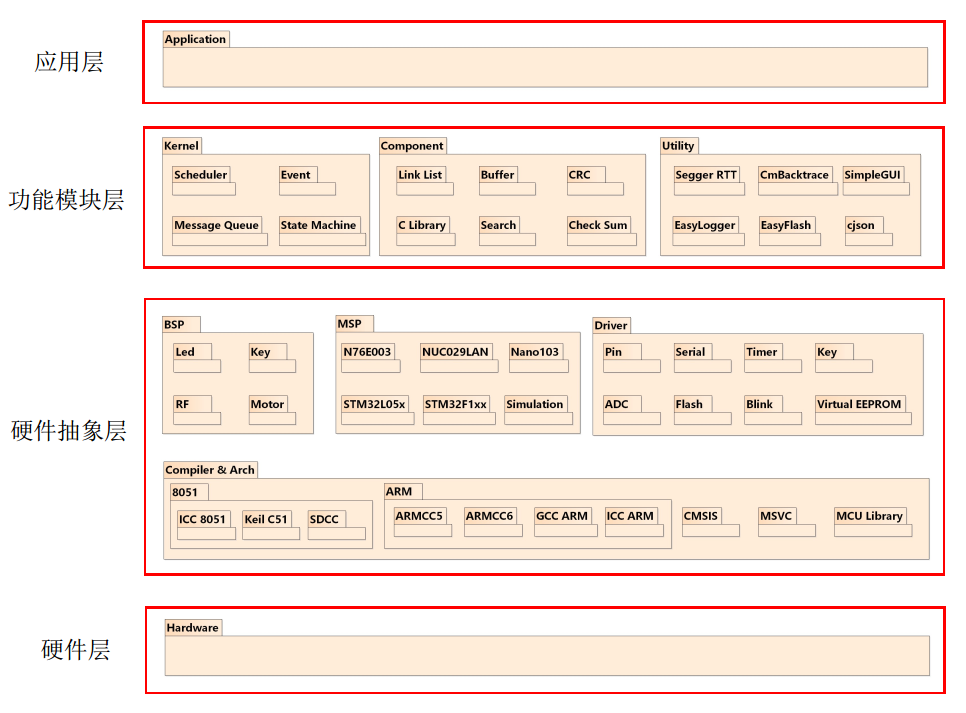
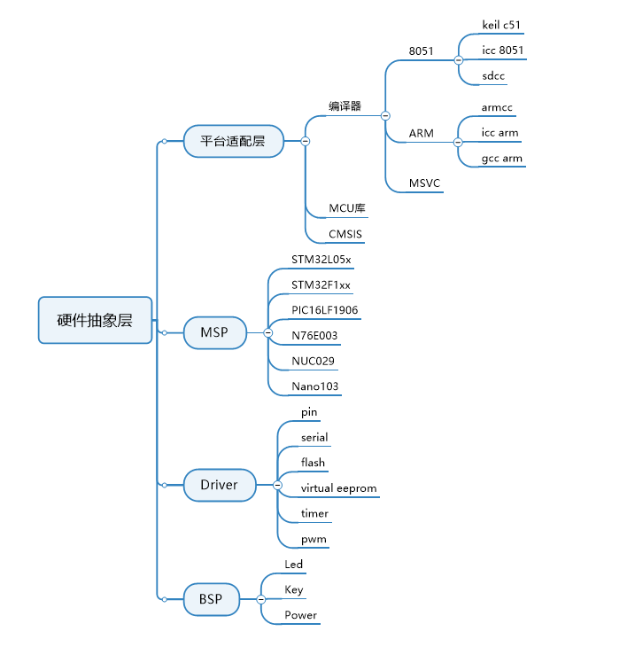
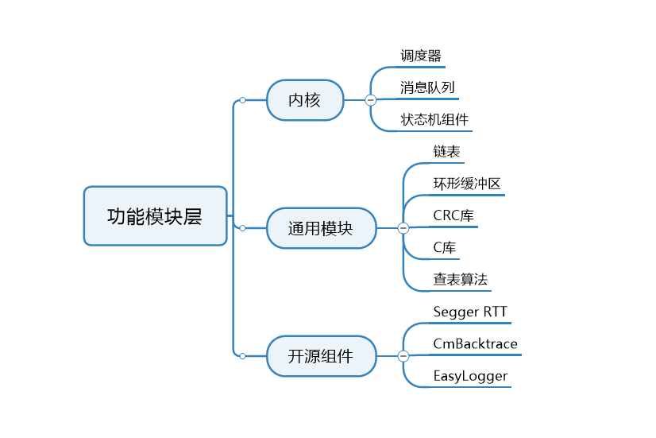
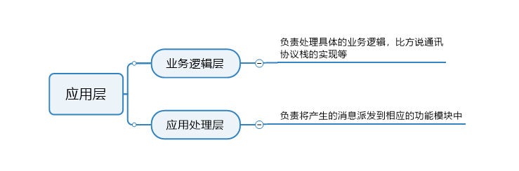

 

  

# 一、相关文档
* [框架目录介绍](https://gitee.com/accumulatedidea/Framework_Open/blob/master/document/dir/dir.md)
* [框架内核介绍]()
* [框架编程规范](https://gitee.com/accumulatedidea/Framework_Open/blob/master/document/rules/code_rules.md) 
* [版本命名规则](https://gitee.com/accumulatedidea/Framework_Open/blob/master/document/rules/version_rules.md)
* [头文件模版](https://gitee.com/accumulatedidea/Framework_Open/blob/master/document/template/inc.h)
* [源文件模版](https://gitee.com/accumulatedidea/Framework_Open/blob/master/document/template/src.c)
* [版本更新日志](https://gitee.com/accumulatedidea/Framework_Open/blob/master/document/update/update.md)
* [例程](https://gitee.com/accumulatedidea/Framework_Open/blob/master/document/demo/demo.c)

# 二、框架简介
YSF全称 Yearnext Software Framework，是一个基于消息驱动的单片机软件框架，具有配置简便、跨平台、可裁剪等特性，框架采用软件分层的思想设计，由下而上的将软件分为5个层级，分别是硬件层、硬件抽象层、功能模块层和应用层，软件架构如图1所示：

## 2.1 硬件层
硬件层为板载硬件。

## 2.2 硬件抽象层
硬件抽象层主要负责将底层的硬件驱动封装成统一的硬件接口，以方便上层应用调用。

硬件抽象层由编译器拓展包、MCU支持包和通用外设驱动包组成，如下图所示：

编译器拓展包主要负责实现框架定义的专用命令和一些基础的数据类型，目前支持Keil、IAR、SDCC、GCC、MSVC等主流编译平台。

MCU支持包负责将原厂的驱动程序转换为统一的MSP API接口，为了兼顾小容量的单片机平台将MSP的API接口分为LV0接口和LV1接口，LV0接口可直接操作底层硬件，基于原厂的驱动程序，具有占用系统空间小的优点，缺点是对于上层的应用程序来说可移植性不太友好，LV1接口为标准的MSP API接口，负责将通用的设备信息转换为LV0接口的专用的设备信息，并通过LV0接口操作底层硬件，具有可移植性好的优点，对于小容量的单片机平台相较于LV0接口占用更大的内存空间。

通用外设驱动包主要负责复杂外设工作机制的实现。

## 2.3 功能模块层
功能模块层由框架内核、功能模块和开源组件组成，如下图所示：

框架内核包含一个小型的任务调度器、消息队列、状态机组件等。

功能模块包含一些常用的数据结构和函数库，如链表、环形缓冲区、CRC库等。

开源组件包含Segger RTT、CmBacktrace、EasyLogger等组件。

## 2.4 应用层
应用层包含业务逻辑层和应用处理层。

业务逻辑层负责处理具体的业务逻辑，例如通讯协议栈的实现等。

应用处理层负责将产生的消息派发到相应的处理模块中。