# 文件目录介绍
## 一、 目录概述
框架目录主要由**3rdparty**、**bsp**、**compiler**、**component**、**document**、**hal**、**kernel**、**protocol**、**utility**这几个文件夹组成，文件目录如图1所示：

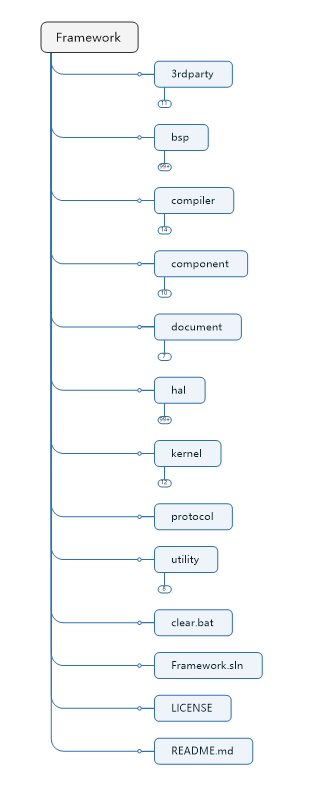

图1

## 二、 3rdparty介绍
3rdparty文件夹里面放置了一些来源组件，目前主要分为debug组件、文件系统、gui组件、test组件，文件目录如图2所示：

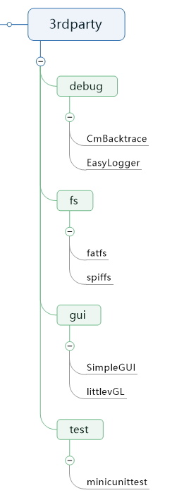

图2

### 组件介绍
|类型|组件|作者|项目主页|备注|
|:-:|:-:|:-:|:-:|:-:|
|debug|CmBacktrace|armink|https://gitee.com/Armink/CmBacktrace|ARM Cortex-M 系列 MCU 错误追踪库|
|-|EasyLogger|armink|https://gitee.com/Armink/EasyLogger|一款超轻量级、高性能的 C/C++ 日志库|
|file system|fatfs|chan|http://elm-chan.org/fsw/ff/00index_e.html|一个通用的文件系统(FAT/exFAT)模块，用于在小型嵌入式系统中实现FAT文件系统|
|-|spiffs|Peter Andersson|https://github.com/pellepl/spiffs|适用于嵌入式设备的SPI Flash文件系统|
|GUI|SimpleGUI|Polarix|https://gitee.com/Polarix/simplegui|一个面向单色显示屏的开源GUI接口库|
|-|lvgl|LittlevGL|https://github.com/littlevgl/lvgl|GUI|
|test|Mini_CUnitTest|D_C_P|https://gitee.com/dcp_483/minicunittest|基于c语言单元测试框架|

## 三、 bsp介绍
**bsp**文件夹里面是工程模版和应用程序，目前包含了HC32L13x、N76E003、NANO103、NUC029、STM32F1xx、STM32L05x、Simulator（MSVC）等平台的工程模版，文件目录如图3所示：

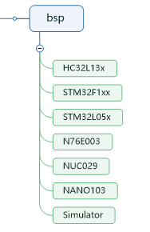

图3

### 工程模版介绍
工程模版以HC32L13x为例，主要由application、paltform和工程文件组成，文件目录如图3-1所示：

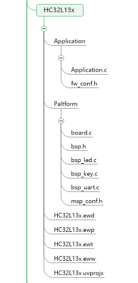

图3-1

application文件夹主要由应用程序和框架配置文件组成。

|文件名|功能|
|-|-|
|Application.c|负责框架内核的初始化和启动以及应用层业务逻辑的调用|
|fw_conf.h|框架配置文件，用于裁剪内核组件|

patlform文件夹主要由板级支持包和MSP配置文件组成。

|文件名|功能|
|-|-|
|board.c|负责初始化硬件，系统时钟处理等功能|
|bsp.h|负责定义板子外设端口、板级支持包API，硬件设置参数等信息|
|bsp_led.c|Board Led驱动|
|bsp_key.c|Board 按键驱动|
|bsp_uart.c|Board 串口驱动|
|msp_conf.h|MSP配置文件，可配置外设时钟、复用引脚、工作模式等|

## 四、 compiler介绍
目前框架支持8051平台和ARM平台，支持keil c51、icc8051、sdcc、armcc5、armcc6、gcc arm、icc arm、msvc、picc等多种编译器，文件目录如图4所示：

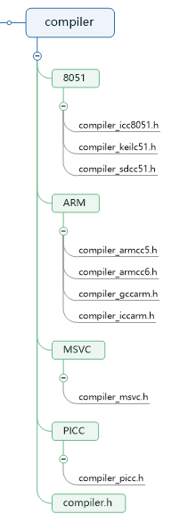

图4

## 五、 component介绍
component包含一些常用的数据结构和函数库，如链表、环形缓冲区、CRC库等，文件目录如图5所示：

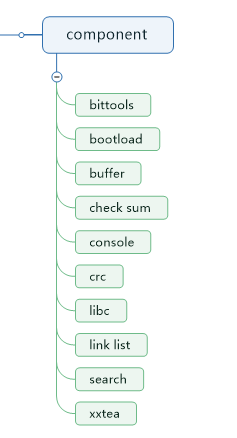

图5

### 组件介绍
|组件名称|功能|备注|
|:-:|:-:|:-:|
|bittools|位操作工具|支持大端内存，小端内存相互转换|
|buffer|环形缓冲区实现|目前已实现环形缓冲区和队列数据结构|
|check sum|校验和计算算法|支持8Bit、16Bit、32Bit、64Bit校验和计算|
|crc|CRC算法实现|参考傻孩子CRC算法|
|libc|标准C库实现|参考uClibc、RT-Thread|
|link list|链表数据结构实现|目前支持单向链表和双向链表|
|search|查表算法|目前支持直接查表法和二分查表法|
|xxtea|xxtea加密/解密库|加密密钥、加密轮数可配置|

## 六、 document介绍
文件目录如图6所示：

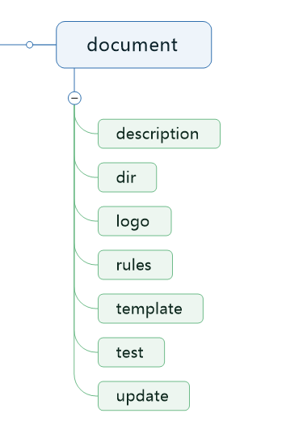

图6

Document目录介绍

|目录名称|备注|
|:-:|:-:|
|description|框架概述|
|dir|框架目录介绍|
|logo|框架logo|
|rules|软件编程规范、版本命名规范|
|template|头文件、源文件模版|
|test|软件测试报告|
|update|框架更新日志|

## 七、 hal文件夹介绍
文件目录如图7所示：

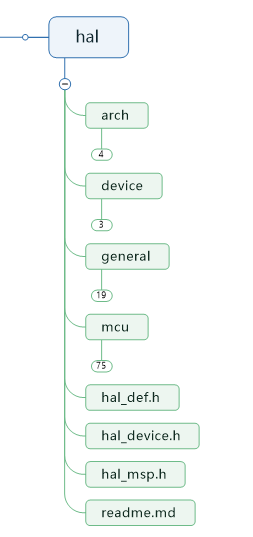

图7

### HAL目录介绍

|目录名称|备注|
|:-:|:-:|
|arch|MCU架构支持组件|
|device|设备驱动程序|
|general|HAL 通用驱动程序|
|mcu|MCU支持包|
|hal_def.h|定义HAL设备信息|
|hal_device.h|定义HAL设备接口|
|hal_msp.h|MSP包API接口文件|

### arch目录介绍
文件目录如图7-2所示：

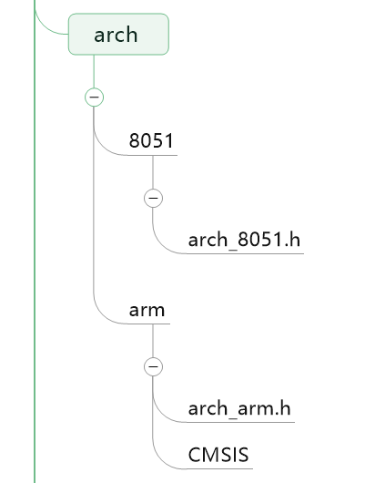

图7-2

### device目录介绍
文件目录如图7-3所示：

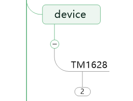

图7-3

### general目录介绍
文件目录如图7-4所示：

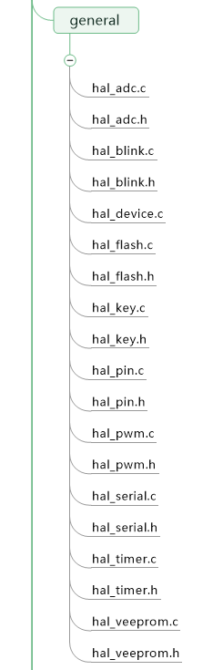

图7-4

### mcu目录介绍
文件目录如图7-5所示：

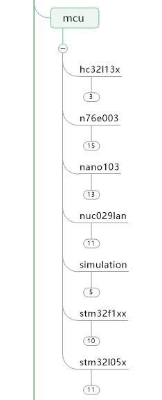

图7-5

## 八、 kernel文件夹介绍
文件目录如图8所示：

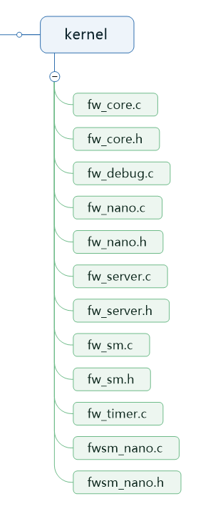

图8

### 内核组件介绍

|内核版本|文件名称|功能|
|:-:|:-:|:-:|
|完整版|fw_core.c|框架内核（完整版）基于协作式任务调度机制，内建定时器、事件、消息队列等组件|
|-|fw_core.h|声明框架内核（完整版）API|
|-|fw_server.c|环形缓冲区、链表等数据结构的实现（由完整版内核调用）|
|-|fw_server.h|声明框架Server API|
|-|fw_sm.c|框架状态机组件的实现（由完整版内核调用）|
|-|fw_sm.h|声明框架状态机组件API|
|-|fw_timer.c|框架定时器组件的实现（由完整版内核调用）|
|-|fw_debug.c|内核调试组件|
|精简版|fw_nano.c|框架内核（精简版）设计思路和完整版类似，但是实现方法不同，且两个版本间的API互不兼容|
|-|fw_nano.h|声明框架内核（精简版）API|
|-|fwsm_nano.c|框架状态机组件的实现（由精简版内核调用）|
|-|fwsm_nano.h|声明框架状态机组件API|

## 九、 protocol文件夹介绍
todo: 待补充

## 十、 utility文件夹介绍
utility主要是MCU原厂驱动库，文件目录如图10所示：

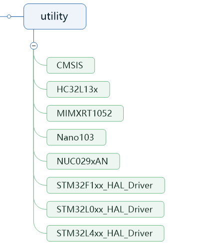

图10
