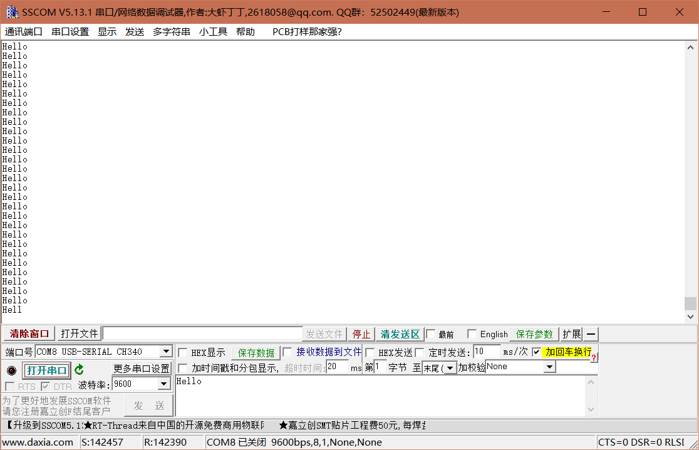
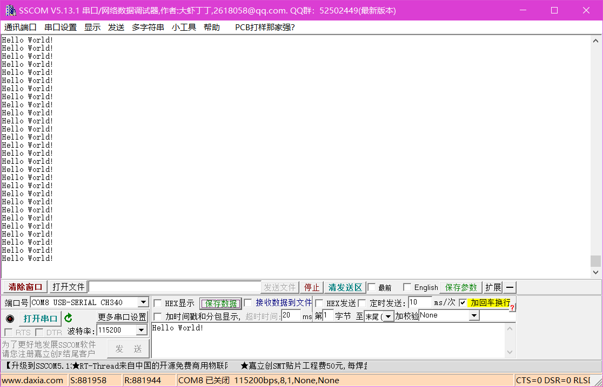

# serial组件测试报告
## 一、测试方法
上位机工具每隔10MS向MCU发送“Hello \r\n”字符串，观察其回显结果，要求波特率在115200以下时收发正确率在100%。

## 二、测试结果
### 2.1 测试结果1
测试波特率: 9600

测试结果：不合格，有存在丢包现象，原因待查明

上位机共发送142457字节数据
MCU共应答142390字节数据，应答20341包“Hello”，其中20315包“Hello”正常，发送正确率为99.9%。

### 2.2 测试结果2
测试波特率: 115200

测试结果：不合格，有存在丢包现象，原因待查明

上位机共发送302736字节数据
MCU共应答301899字节数据，应答21538包“Hello World!”，其中20981包“Hello World!”正常，发送正确率为97.4%。

### 2.2 测试结果3
测试波特率: 115200

测试结果：合格

上位机共发送881958字节数据
MCU共应答881944字节数据，应答62996包“Hello World!”，其中62996包“Hello World!”正常，发送正确率为100%。

